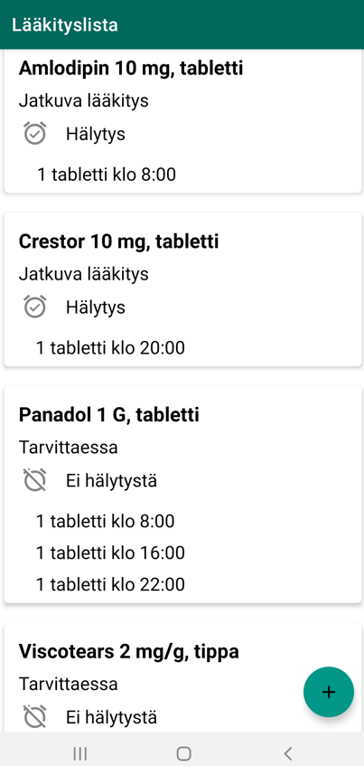
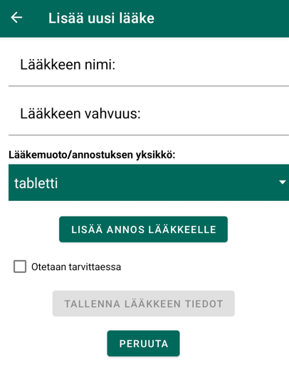
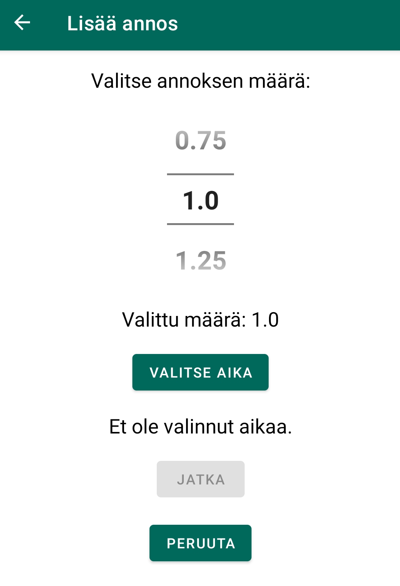
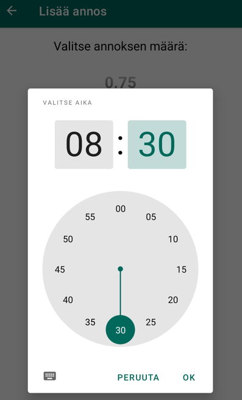
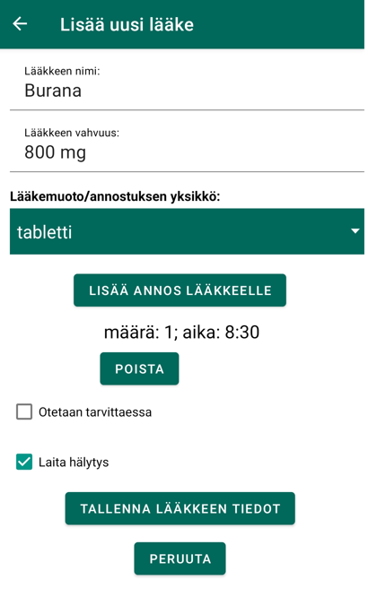
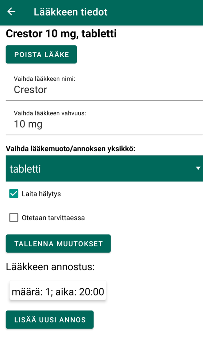
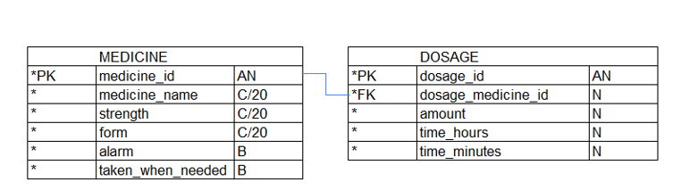

# Medilista - a medicine list and medication reminder app

## Introduction

The purpose of this project was to learn Android development and Kotlin by building a medication list/medicine reminder app. Also, accessibility issues were taken into account during this project. Currently the app is in Finnish.

## Medilista app

Medilista app is meant for users who want to use a medication list and get medication reminders. The medicines are shown in a list, where the user can see the medicines with their dosages, medicine notification state (alarm or not) and medicine status (taken when needed/continuous medication). The users can add, edit and delete their medicines and respective dosages. 

## The user interface

The user sees all the medicines and their dosages in the main view. By clicking the floating action button the user enters the "add new medicine" view where the user can add a new medicine and dosages to it. By clicking the medicine card the user enters the "edit medicine/dosages" view where the user can edit or delete medicines and dosages. 

## The database

> ### _MEDICINE_
> _MEDICINE-table holds the medicine info._
>
> Field | Type | Description
> ------ | ------ | ------
> medicine_id | int PK | The id of the medicine
> medicine_name | varchar(20) |  The name of the medicine
> strength | varchar(20) |  The strength of the medicine
> form | varchar(20) |  The medicine form (tablet, capsule, liquid...)
> alarm | boolean |  True, if user wants notifications for medication time
> taken_when_needed | boolean |  The medicine is taken when needed (true), or continuos medication (false)

> ### _DOSAGE_
> _DOSAGE-TABLE holds the medication time and the medicine amount of a dosage. A medicine can have many dosages._
>
> Field | Type | Description
> ------ | ------ | ------
> dosage_id | int PK | The id of the dosage id
> dosage_medicine_id | int FK | The medicine of the dosage, a reference to the [MEDICINE](#MEDICINE) table
> amount | double |  The amount of the dosage
> time_hours | int |  The medication time, hours
> time_minutes | int |  The medication time, minutes

## Sources

[Eric Ampire: Nested RecyclerView and DataBinding](https://proandroiddev.com/nested-recyclerview-and-databinding-a4943d05dbda)

[Android Developers](https://developer.android.com/)

[Android Dvlpr: Custom Spinner Android Styling Tutorial | Java and Kotlin](https://androiddvlpr.com/custom-spinner-android/)

[Myrick Chow: Android AlarmManager As Deep As Possible](https://proandroiddev.com/android-alarmmanager-as-deep-as-possible-909bd5b64792)

[Google code labs: Android Kotlin notifications](https://github.com/googlecodelabs/android-kotlin-notifications)

[Philipp Lackner: Multiple Room Tables](https://github.com/philipplackner/MultipleRoomTables)

[Philipp Lackner: Testing Room DB](https://github.com/philipplackner/ShoppingListTestingYT/)

[Desmond Lua: Android AlarmManager: Multiple Alarm With Arguments/Parameters (Pass Value)](https://code.luasoftware.com/tutorials/android/android-alarmmanager-multiple-alarm-with-arguments/)

[Udacity: Sleep Tracker](https://github.com/udacity/andfun-kotlin-sleep-tracker-with-recyclerview/)
